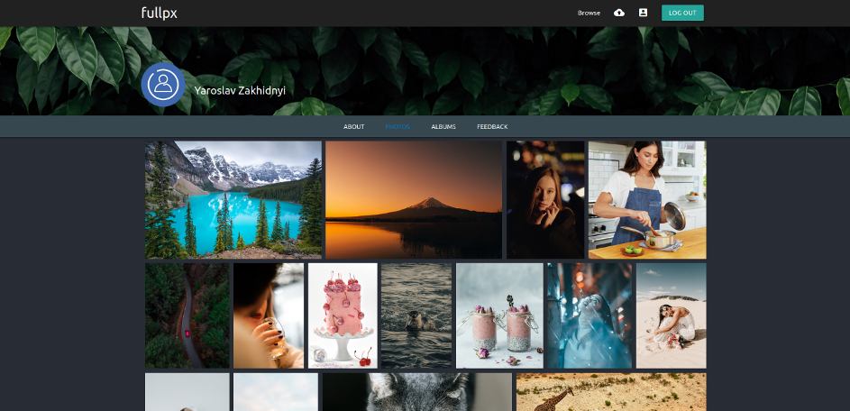

# Fullpx-client (SPA)

"Fullpx-client" is a SPA built on Angular.
It is client's part of the application "Fullpx" - web-service for publishing photos and creating portfolio for photografers.
Server's part of the application is "Fullpx-server" which you can see by accessing this github [link](https://github.com/yarikwest/fullpx-server)

### Tech

* [Angular] - v8
* [RxJS]
* [Materialize CSS] - v1.0.0, a modern responsive front-end framework based on Material Design
* [Flex Gallery] - Flex Gallery is a flexible responsive justified image gallery with CSS and jQuery.

### Run

Full application deployed on Heroku by this [link](https://fullpx.herokuapp.com/)

### Todos

 - Write Tests
 - Write own algorithm for flexible gallery using Angular approuch

   [Angular]: <https://angular.io/>
   [Materialize CSS]: <https://materializecss.com/>
   [RxJS]: <https://rxjs-dev.firebaseapp.com/>
   [Flex Gallery]: <https://github.com/elvisyjlin/flex-gallery>
